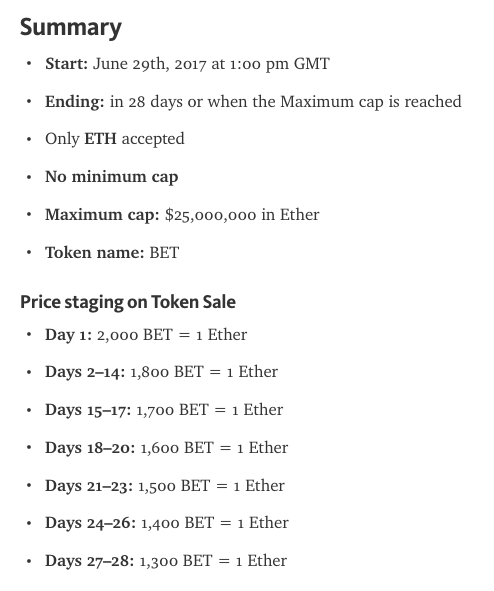
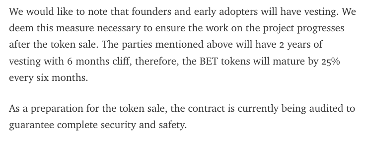

# Dao.Casino Presale Contract Audit (Work In Progress)

Bok Consulting Pty Ltd has been retained by [Dao.Casino](https://dao.casino/) to audit the Ethereum contract to be used in Dao.Casino's upcoming crowdsale. 
The [audit of Dao.Casino's original contracts](README-Original.md) found quite a few issues to do with trustlessness and the convoluted nature of the code.

A [new crowdsale contract](contracts/DaoCasinoToken.sol) was proposed by Bok Consulting Pty Ltd and this contract will be used for Dao.Casino's 
crowdsale. This report is a self-audit of the new contracts.

From [DAO.Casino Announces Terms of its Token Sale to be held June 29](https://medium.com/@dao.casino/dao-casino-announces-terms-of-its-token-sale-to-be-held-june-29-5125375f4aeb), 
this crowdsale has the following parameters:

<kbd></kbd>

<br />

<hr />

## Table Of Contents

* [Summary](#summary)
  * [Crowdsale Source Code](#crowdsale-source-code)
  * [Trustlessness?](#trustlessness)
  * [No Security Risk Identifier Yet](#no-security-risk-identified-yet)
  * [Tokens](#tokens)
  * [Vesting?](#vesting)
  * [Due Diligence Required](#due-diligence-required)
  * [Recommendation](#recommendation)
* [Scope](#scope)
* [Limitations](#limitations)
* [Due Diligence](#due-diligence)
* [Risks](#risks)
* [Recommendations](#recommendations)
* [TODO](#todo)
* [Crowdsale Contract Source Code](#crowdsale-contract-source-code)

<br />

<hr />

## Summary

### Crowdsale Source Code
The **DaoCasinoICO** and **TokenEmission** contracts are well formatted and set out, but there is an unnecessary convoluted relationship between these two contracts.
There is also some unnecessary overloading of data (`totalSupply`), modifiers (`onlySuccess`) and functions (`bountyValue(...)`, `withdraw()`) that makes understanding 
these contracts a little bit harder.

### Trustlessness?
These contracts were not designed with trustlessness as a primary aim. This is highlighted by the ability to premine tokens after deployment of **TokenEmission** and 
before **TokenEmission** is linked to **DaoCasinoICO**, and the inclusion of the refund facility (but inactive because of the lack of a minimum funding goal) while at
the same time allowing the owners to withdraw funds from the **DaoCasinoICO** using the `withdrawEth()` function.

Additionally the parameters used in the deployment of this contract will need to be confirmed.

### No Security Risk Identified Yet
No serious security risk has been identified in the contracts yet. It is however recommended that the owner of the contracts frequently drain the ethers from the 
**DaoCasinoICO** contract into a more secure external `fund` wallet using the `withdrawEth()` function. This is to avoid **DaoCasinoICO** from being an attractive attack target.

### Tokens
These contracts could have been designed to deliver the tokens directly after participants send their ETH, thus keeping participants wondering what number of tokens they
"bought" with their ethers. Instead participants will be able to query the non-standard `bounties` field (when the source code is verified on EtherScan) to determine the 
number of tokens they have bought.

### Vesting?
From the blog post [DAO.Casino Announces Terms of its Token Sale to be held June 29](https://medium.com/@dao.casino/dao-casino-announces-terms-of-its-token-sale-to-be-held-june-29-5125375f4aeb):

<kbd></kbd>

Note that there is **NO** vesting built into any of the **DaoCasinoICO** or **TokenEmission** contracts audited.

### Due Diligence Required
As always, potential participants should perform their [due diligence](#due-diligence) before investing into any crowdsale, including this one.

### Recommendation
The crowdsale should be delayed until the vesting functionality is written into the crowdsale contracts. Other issues identified in this report should also be addressed at the same time.
Or that the blog post be updated clearly stating that there is no vesting built into the contracts.

<br />

<hr />

## Scope
This audit is into the technical aspects of the crowdsale contracts. The primary aim of this audit is to ensure that funds contributed to these contracts are not easily attacked or stolen by third parties. 
The secondary aim of this audit is that ensure the coded algorithms work as expected. This audit does not guarantee that that the code is bugfree, but intends to highlight any areas of weaknesses.

<br />

<hr />

## Limitations
This audit makes no statements or warranties about the viability of the Dao.Casino's business proposition, the individuals involved in this business or the regulatory regime for the business model.

<br />

<hr />

## Due Diligence
As always, potential participants in any crowdsale are encouraged to perform their due diligence on the business proposition before funding the crowdsale.

Potential participants are also encouraged to only send their funds to the official crowdsale Ethereum address, as scammers have been publishing phishing address in the Slacks, Subreddits, Twitter and other communication channels. 
Potential participants should also confirm that the verified source code on EtherScan.io for the published crowdsale address matches the audited source code audited, and that the deployment parameters are correctly set.

Potential participants should note that there is no minimum funding goal in this crowdsale. The `Crowdfunding.refund()` function that **DaoCasinoICO** inherits will be ineffective in this crowdsale due to the lack of a minimum funding goal. The owner of the contracts also has the ability 
to withdraw any funds using the `DaoCasinoICO.withdrawEth()` function at any time during the crowdsale, rendering the refund functionality ineffective IF a minimum funding goal was set.

<br />

<hr />

## Risks

The primary risk of crowdfunding contracts is that the high value of ethers held by a newly designed un-battle tested contract is a target for attack.

While this crowdsale contract will accumulate ethers during the crowdsale. The owner of the contracts is advised to periodically withdraw ETH from the crowdsale contracts to reduce the risk of attacks on the contract.

If there is a logic error in the calculations


<br />

<hr />

## Potential Vulnerabilities


<br />

<hr />

## Recommendations

* **HIGH IMPORTANCE** - The crowdsale should be delayed until the crowdsale contracts are re-written to reflect the offering described in the [blog post](https://medium.com/@dao.casino/dao-casino-announces-terms-of-its-token-sale-to-be-held-june-29-5125375f4aeb), 
and this is primarily the vesting of the tokens. Or that the blog post be updated clearly stating that there is no vesting built into the contracts.

* LOW IMPORTANCE - As found by Darryl Morris, `Token.totalSupply` will hide `ERC20.totalSupply` and should be removed. This variable is unused in the **ERC20** contract, will always be set to 0. The **TokenEmission** version of `totalSupply` will be used to record the total supply of tokens

* LOW IMPORTANCE - Add a function for the owner to transfer out any other ERC20 tokens from the TokenEmission contract - see the example [`transferAnyERC20Token(...)`](https://github.com/openanx/OpenANXToken/blob/master/contracts/OpenANXToken.sol#L451-L458)

* LOW IMPORTANCE - The relationship between the **TokenEmission** contract and the **DaoCasinoICO** contract requires that the **TokenEmission** `owner` and `hammer` variables point to the **DaoCasinoICO** contract address. If the `owner` variable is not correctly set, the **TokenEmission** contract will fail to create the tokens for the accounts sending ETH to the **DaoCasinoICO** contract 

* NOTE - When an account sends ETH to the **DaoCasinoICO** contract, the tokens are created in the **TokenEmission** contract, but assigned to the address of the **DaoCasinoICO** in the **TokenEmission** contract. The participant's account, or the owner of the contracts will have to call `getBounty(...)` for the tokens to be transferred to the participant's account, and this can only be executed if the crowdsale is successful

* NOTE - For the crowdsale `onlySuccess` modifier to indicate a successful status, the funding has to **EXACTLY** match the crowdsale maximum cap in ETH (as `totalFunded == config.maxValue` in `DaoCasinoICO.onlySuccess`), or the current time has to be past the crowdsale closing date. If the funding is close to the cap, anyone including the owner will have the ability to top up the crowdsale funds for this match to occur for this crowdsale to end earlier than the intended closing date 

* The **DaoCasinoICO** contract has several constructor parameters that are unused in any calculations: `_reference`, `_startRatio`, `_reductionStep` and `_reductionValue`. Ideally these should be removed to make the code more easily readable

* The **DaoCasinoICO** contract has several functions and modifiers that overload the **Crowdfunding** contract functions and modifiers: `bountyValue(...)`, `onlySuccess`, `withdraw()`. Ideally these should be removed from the **Crowdfunding** contract to make the code more easily readable

* The **TokenEmission** contract should implement the `function () payable { throw; }` function to reject any ETH being sent to it, as there will be no ability to withdraw these ETH from this token contract

* LOW IMPORTANCE - There is no easy way to work out whether these contracts are computing the correct number of tokens for the ETH that participants send. It is easy to log an event that will help keep track of the calculations. Example [`TokensBought(...)`](https://github.com/openanx/OpenANXToken/blob/master/contracts/OpenANXToken.sol#L260-L261) that can easily be extracted to create a near-realtime [report](https://github.com/openanx/OpenANXToken/blob/master/scripts/TokensBought_20170625_015900.tsv)
 
<br />

## TODO

* Overview comments on the source code

* Overflow

* Underflow

* Logic hijacking

* This contract uses block numbers to determine the start, end and token rate changed in the crowdsale. As these block numbers are variable and increasing, only approximate times can be published for these dates. Expect some of the transactions to throw errors due to unexpected block numbers.

* An unlimited number of tokens can be created during the deployment of **TokenEmission**

* As there are quite a parameters that interlink the **DaoCasinoICO* and **TokenEmission** contracts together, it is recommended that a script be created to easily display these parameters and check for correctness 

<br />

<hr />

## Crowdsale Contract Source Code

Following is the source code of the [contracts/DaoCasinoToken.sol](contracts/DaoCasinoToken.sol), with my commentary marked with `// BK`.

```javascript
// BK Ok - Recent version
pragma solidity ^0.4.11;

// ----------------------------------------------------------------------------
// Dao.Casino Crowdsale Token Contract (Under Consideration)
//
// Enjoy. (c) BokkyPooBah / Bok Consulting Pty Ltd 2017
// The MIT Licence (Under Consideration).
// ----------------------------------------------------------------------------


// ----------------------------------------------------------------------------
// Safe maths, borrowed from OpenZeppelin
// ----------------------------------------------------------------------------
library SafeMath {

    // ------------------------------------------------------------------------
    // Add a number to another number, checking for overflows
    // ------------------------------------------------------------------------
    // BK Ok - Overflow protected
    function add(uint a, uint b) internal returns (uint) {
        uint c = a + b;
        assert(c >= a && c >= b);
        return c;
    }

    // ------------------------------------------------------------------------
    // Subtract a number from another number, checking for underflows
    // ------------------------------------------------------------------------
    // BK Ok - Underflow protected
    function sub(uint a, uint b) internal returns (uint) {
        assert(b <= a);
        return a - b;
    }
}


// ----------------------------------------------------------------------------
// Owned contract
// ----------------------------------------------------------------------------
contract Owned {
    // BK Next 3 lines Ok
    address public owner;
    address public newOwner;
    event OwnershipTransferred(address indexed _from, address indexed _to);

    // BK Ok - Constructor assigns `owner` variable
    function Owned() {
        owner = msg.sender;
    }

    // BK Ok - Only owner can execute function
    modifier onlyOwner {
        // BK Ok - Could be replaced with `require(msg.sender == owner);`
        if (msg.sender != owner) throw;
        _;
    }

    // BK Ok - Propose ownership transfer
    function transferOwnership(address _newOwner) onlyOwner {
        newOwner = _newOwner;
    }
 
    // BK Ok - Accept ownership transfer
    function acceptOwnership() {
        if (msg.sender == newOwner) {
            OwnershipTransferred(owner, newOwner);
            owner = newOwner;
        }
    }
}


// ----------------------------------------------------------------------------
// ERC20 Token, with the addition of symbol, name and decimals
// https://github.com/ethereum/EIPs/issues/20
// ----------------------------------------------------------------------------
contract ERC20Token is Owned {
    // BK Ok - For overflow and underflow protection
    using SafeMath for uint;

    // ------------------------------------------------------------------------
    // Total Supply
    // ------------------------------------------------------------------------
    // BK Ok
    uint256 _totalSupply = 0;

    // ------------------------------------------------------------------------
    // Balances for each account
    // ------------------------------------------------------------------------
    // BK Ok
    mapping(address => uint256) balances;

    // ------------------------------------------------------------------------
    // Owner of account approves the transfer of an amount to another account
    // ------------------------------------------------------------------------
    // BK Ok
    mapping(address => mapping (address => uint256)) allowed;

    // ------------------------------------------------------------------------
    // Get the total token supply
    // ------------------------------------------------------------------------
    // BK Ok
    function totalSupply() constant returns (uint256 totalSupply) {
        totalSupply = _totalSupply;
    }

    // ------------------------------------------------------------------------
    // Get the account balance of another account with address _owner
    // ------------------------------------------------------------------------
    // BK Ok
    function balanceOf(address _owner) constant returns (uint256 balance) {
        return balances[_owner];
    }

    // ------------------------------------------------------------------------
    // Transfer the balance from owner's account to another account
    // ------------------------------------------------------------------------
    // BK NOTE - This function will return true/false instead of throwing an
    //           error, as the conditions protect against overflows and 
    //           underflows
    // BK NOTE - This function does not protect against the short address
    //           bug, but the short address bug is more the responsibility
    //           of automated processes checking the data sent to this function
    function transfer(address _to, uint256 _amount) returns (bool success) {
        // BK Ok - Account has sufficient balance to transfer
        if (balances[msg.sender] >= _amount                // User has balance
            // BK Ok - Non-zero amount
            && _amount > 0                                 // Non-zero transfer
            // BK Ok - Overflow protection
            && balances[_to] + _amount > balances[_to]     // Overflow check
        ) {
            // BK Ok
            balances[msg.sender] = balances[msg.sender].sub(_amount);
            // BK Ok
            balances[_to] = balances[_to].add(_amount);
            // BK Ok - Logging
            Transfer(msg.sender, _to, _amount);
            return true;
        } else {
            return false;
        }
    }

    // ------------------------------------------------------------------------
    // Allow _spender to withdraw from your account, multiple times, up to the
    // _value amount. If this function is called again it overwrites the
    // current allowance with _value.
    // ------------------------------------------------------------------------
    // BK NOTE - This simpler method of `approve(...)` together with 
    //           `transferFrom(...)` can be used in the double spending attack, 
    //           but the risk is low, and can be mitigated by the user setting 
    //           the approval limit to 0 before changing the limit 
    function approve(
        address _spender,
        uint256 _amount
    ) returns (bool success) {
        // BK Ok
        allowed[msg.sender][_spender] = _amount;
        Approval(msg.sender, _spender, _amount);
        return true;
    }

    // ------------------------------------------------------------------------
    // Spender of tokens transfer an amount of tokens from the token owner's
    // balance to the spender's account. The owner of the tokens must already
    // have approve(...)-d this transfer
    // ------------------------------------------------------------------------
    // BK NOTE - This function will return true/false instead of throwing an
    //           error, as the conditions protect against overflows and 
    //           underflows
    // BK NOTE - This simpler method of `transferFrom(...)` together with 
    //           `approve(...)` can be used in the double spending attack, 
    //           but the risk is low, and can be mitigated by the user setting 
    //           the approval limit to 0 before changing the limit 
    // BK NOTE - This function does not protect against the short address
    //           bug, but the short address bug is more the responsibility
    //           of automated processes checking the data sent to this function
    function transferFrom(
        address _from,
        address _to,
        uint256 _amount
    ) returns (bool success) {
        // BK Ok - Account has sufficient balance to transfer
        if (balances[_from] >= _amount                  // From a/c has balance
            // BK Ok - Account is authorised to spend at least this amount
            && allowed[_from][msg.sender] >= _amount    // Transfer approved
            // BK Ok - Non-zero amount
            && _amount > 0                              // Non-zero transfer
            // BK Ok - Overflow protection
            && balances[_to] + _amount > balances[_to]  // Overflow check
        ) {
            // BK Ok
            balances[_from] = balances[_from].sub(_amount);
            // BK Ok
            allowed[_from][msg.sender] = allowed[_from][msg.sender].sub(_amount);
            // BK Ok
            balances[_to] = balances[_to].add(_amount);
            // BK Ok
            Transfer(_from, _to, _amount);
            return true;
        } else {
            return false;
        }
    }

    // ------------------------------------------------------------------------
    // Returns the amount of tokens approved by the owner that can be
    // transferred to the spender's account
    // ------------------------------------------------------------------------
    // BK Ok
    function allowance(
        address _owner, 
        address _spender
    ) constant returns (uint256 remaining) {
        return allowed[_owner][_spender];
    }

    // BK Ok
    event Transfer(address indexed _from, address indexed _to, uint256 _value);
    // BK Ok
    event Approval(address indexed _owner, address indexed _spender,
        uint256 _value);
}


contract DaoCasinoToken is ERC20Token {

    // ------------------------------------------------------------------------
    // Token information
    // ------------------------------------------------------------------------
    // BK Next 3 lines Ok. Using uint8 for decimals instead of uint256
    string public constant symbol = "BET";
    string public constant name = "Dao.Casino";
    uint8 public constant decimals = 18;

    // > new Date("2017-06-29T13:00:00").getTime()/1000
    // 1498741200
    // Do not use `now` here
    // BK NOTE - This contract uses the date/time instead of blocks to determine
    //           the start, end and BET/ETH scale. The use of date/time in 
    //           these contracts can be used by miners to skew the block time.
    //           This is not a significant risk in a crowdfunding contract.
    uint256 public constant STARTDATE = 1498741200;
    // BK Ok
    uint256 public constant ENDDATE = STARTDATE + 28 days;

    // Cap USD 25mil @ 296.1470 ETH/USD
    // BK NOTE - The following constant will need to be updated with the correct
    //           ETH/USD exchange rate. The aim for Dao.Casino is to raise
    //           USD 25 million, INCLUDING the precommitments. This cap will
    //           have to take into account the ETH equivalent amount of the
    //           precommitment 
    uint256 public constant CAP = 84417 ether;

    // Cannot have a constant address here - Solidity bug
    // https://github.com/ethereum/solidity/issues/2441
    // BK Ok
    address public multisig = 0xa22AB8A9D641CE77e06D98b7D7065d324D3d6976;

    // BK Ok - To compare against the `CAP` variable
    uint256 public totalEthers;

    // BK Ok - Constructor
    function DaoCasinoToken() {
    }


    // ------------------------------------------------------------------------
    // Tokens per ETH
    // Day  1    : 2,000 BET = 1 Ether
    // Days 2–14 : 1,800 BET = 1 Ether
    // Days 15–17: 1,700 BET = 1 Ether
    // Days 18–20: 1,600 BET = 1 Ether
    // Days 21–23: 1,500 BET = 1 Ether
    // Days 24–26: 1,400 BET = 1 Ether
    // Days 27–28: 1,300 BET = 1 Ether
    // ------------------------------------------------------------------------
    // BK Ok - Calculate the BET/ETH at this point in time
    function buyPrice() constant returns (uint256) {
        return buyPriceAt(now);
    }

    // BK Ok - Calculate BET/ETH at any point in time. Can be used in EtherScan
    //         to determine past, current or future BET/ETH rate 
    // BK NOTE - Scale is continuous
    function buyPriceAt(uint256 at) constant returns (uint256) {
        if (at < STARTDATE) {
            return 0;
        } else if (at < (STARTDATE + 2 days)) {
            return 2000;
        } else if (at < (STARTDATE + 15 days)) {
            return 1800;
        } else if (at < (STARTDATE + 18 days)) {
            return 1700;
        } else if (at < (STARTDATE + 21 days)) {
            return 1600;
        } else if (at < (STARTDATE + 24 days)) {
            return 1500;
        } else if (at < (STARTDATE + 27 days)) {
            return 1400;
        } else if (at <= ENDDATE) {
            return 1300;
        } else {
            return 0;
        }
    }


    // ------------------------------------------------------------------------
    // Buy tokens from the contract
    // ------------------------------------------------------------------------
    // BK Ok - Account can send tokens directly to this contract's address
    function () payable {
        proxyPayment(msg.sender);
    }


    // ------------------------------------------------------------------------
    // Exchanges can buy on behalf of participant
    // ------------------------------------------------------------------------
    // BK Ok
    function proxyPayment(address participant) payable {
        // No contributions before the start of the crowdsale
        // BK Ok
        require(now >= STARTDATE);
        // No contributions after the end of the crowdsale
        // BK Ok
        require(now <= ENDDATE);
        // No 0 contributions
        // BK Ok
        require(msg.value > 0);

        // Add ETH raised to total
        // BK Ok - Overflow protected
        totalEthers = totalEthers.add(msg.value);
        // Cannot exceed cap
        // BK Ok
        require(totalEthers <= CAP);

        // What is the BET to ETH rate
        // BK Ok
        uint256 _buyPrice = buyPrice();

        // Calculate #BET - this is safe as _buyPrice is known
        // and msg.value is restricted to valid values
        // BK Ok
        uint tokens = msg.value * _buyPrice;

        // Check tokens > 0
        // BK Ok
        require(tokens > 0);
        // Compute tokens for foundation 30%
        // Number of tokens restricted so maths is safe
        // BK Ok
        uint multisigTokens = tokens * 3 / 7;

        // Add to total supply
        // BK Ok
        _totalSupply = _totalSupply.add(tokens);
        // BK Ok
        _totalSupply = _totalSupply.add(multisigTokens);

        // Add to balances
        // BK Ok
        balances[participant] = balances[participant].add(tokens);
        // BK Ok
        balances[multisig] = balances[multisig].add(multisigTokens);

        // Log events
        // BK Next 4 lines Ok
        TokensBought(participant, msg.value, totalEthers, tokens,
            multisigTokens, _totalSupply, _buyPrice);
        Transfer(0x0, participant, tokens);
        Transfer(0x0, multisig, multisigTokens);

        // Move the funds to a safe wallet
        // https://github.com/ConsenSys/smart-contract-best-practices#be-aware-of-the-tradeoffs-between-send-transfer-and-callvalue
        multisig.transfer(msg.value);
    }
    // BK Ok
    event TokensBought(address indexed buyer, uint256 ethers, 
        uint256 newEtherBalance, uint256 tokens, uint256 multisigTokens, 
        uint256 newTotalSupply, uint256 buyPrice);


    // ------------------------------------------------------------------------
    // Owner to add precommitment funding token balance before the crowdsale
    // commences
    // ------------------------------------------------------------------------
    // BK NOTE - Owner can only execute this before the crowdsale starts
    // BK NOTE - Owner must add amount * 3 / 7 for the foundation for each
    //           precommitment amount
    // BK NOTE - The CAP must take into account the equivalent ETH raised
    //           for the precommitment amounts
    function addPrecommitment(address participant, uint balance) onlyOwner {
        // BK Ok
        require(now < STARTDATE);
        // BK Ok
        require(balance > 0);
        // BK Ok
        balances[participant] = balances[participant].add(balance);
        // BK Ok
        _totalSupply = _totalSupply.add(balance);
        // BK Ok
        Transfer(0x0, participant, balance);
    }


    // ------------------------------------------------------------------------
    // Transfer the balance from owner's account to another account, with a
    // check that the crowdsale is finalised
    // ------------------------------------------------------------------------
    // BK Ok
    function transfer(address _to, uint _amount) returns (bool success) {
        // Cannot transfer before crowdsale ends or cap reached
        // BK Ok
        require(now > ENDDATE || totalEthers == CAP);
        // Standard transfer
        // BK Ok
        return super.transfer(_to, _amount);
    }


    // ------------------------------------------------------------------------
    // Spender of tokens transfer an amount of tokens from the token owner's
    // balance to another account, with a check that the crowdsale is
    // finalised
    // ------------------------------------------------------------------------
    // BK Ok
    function transferFrom(address _from, address _to, uint _amount) 
        returns (bool success)
    {
        // Cannot transfer before crowdsale ends or cap reached
        // BK Ok
        require(now > ENDDATE || totalEthers == CAP);
        // Standard transferFrom
        // BK Ok
        return super.transferFrom(_from, _to, _amount);
    }


    // ------------------------------------------------------------------------
    // Owner can transfer out any accidentally sent ERC20 tokens
    // ------------------------------------------------------------------------
    // BK Ok - Only owner
    function transferAnyERC20Token(address tokenAddress, uint amount)
      onlyOwner returns (bool success) 
    {
        // BK Ok
        return ERC20Token(tokenAddress).transfer(owner, amount);
    }
}
```

<br />

<br />

Enjoy. (c) Dao.Casino and BokkyPooBah / Bok Consulting Pty Ltd for Dao.Casino Jun 29 2017. The MIT Licence.