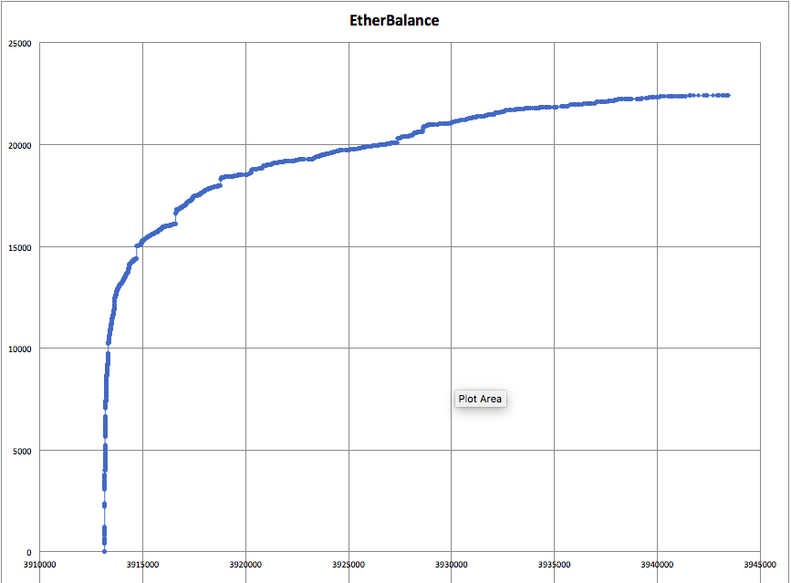
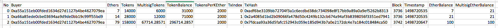

# Dao.Casino Crowdsale Contract Audit (First Draft Version)

Bok Consulting Pty Ltd has been retained by [Dao.Casino](https://dao.casino/) to audit the Ethereum contracts for use in Dao.Casino's upcoming crowdsale. 
The [audit of Dao.Casino's original contracts](README-Original.md) found a few issues described in more detail in the [Summary](#summary) section below.

A [new crowdsale contract](contracts/DaoCasinoToken.sol) was proposed by Bok Consulting Pty Ltd and this contract will be used for Dao.Casino's 
crowdsale. This report is a self-audit of the new contracts. Darryl Morris has provided an independent [audit of of this crowdsale contract](DarrylMorris-Audit2-DaoCasinoICO.md) as well.

<br />

## Crowdsale Contract On Mainnet

This crowdsale contract has been deployed to [0x2b09b52d42dfb4e0cba43f607dd272ea3fe1fb9f](https://etherscan.io/address/0x2b09b52d42dfb4e0cba43f607dd272ea3fe1fb9f#internaltx), with the following parameters:

* STARTDATE: `1498741200` `new Date(1498741200*1000).toUTCString()` -> `Thu, 29 Jun 2017 13:00:00 UTC`
* ENDDATE: `1501074000` `new Date(1501074000*1000).toUTCString()` -> `Wed, 26 Jul 2017 13:00:00 UTC`
* CAP: `83333330000000000000000` `web3.fromWei("83333330000000000000000", "ether")` -> `83333.33`
* multisig: [0x4938c291ab7e5e51198dfc210824da5d1bd759bf](https://etherscan.io/address/0x4938c291ab7e5e51198dfc210824da5d1bd759bf)

The period is calculated as `(new Date(1501074000*1000).getTime()-new Date(1498741200*1000).getTime())/1000/60/60/24` -> `27` days. This is different to the 28 days stated in the blog.

At Thu, 29 Jun 2017 00:30:00 UTC, the ETH/USD rate was ~ 328.2950 . `web3.fromWei("83333330000000000000000", "ether")*328.2950` -> `27,357,915.572350003`

Following is a query of the `buyPriceAt(...)` function to determine the BET/ETH rate 1 second before and 1 second after the crowdsale start to the end +/- 2 days:

    day=1498568400 Tue, 27 Jun 2017 13:00:00 GMT before=0 after=0
    day=1498654800 Wed, 28 Jun 2017 13:00:00 GMT before=0 after=0
    day=1498741200 Thu, 29 Jun 2017 13:00:00 GMT before=0 after=2000
    day=1498827600 Fri, 30 Jun 2017 13:00:00 GMT before=2000 after=1800
    day=1498914000 Sat, 01 Jul 2017 13:00:00 GMT before=1800 after=1800
    day=1499000400 Sun, 02 Jul 2017 13:00:00 GMT before=1800 after=1800
    day=1499086800 Mon, 03 Jul 2017 13:00:00 GMT before=1800 after=1800
    day=1499173200 Tue, 04 Jul 2017 13:00:00 GMT before=1800 after=1800
    day=1499259600 Wed, 05 Jul 2017 13:00:00 GMT before=1800 after=1800
    day=1499346000 Thu, 06 Jul 2017 13:00:00 GMT before=1800 after=1800
    day=1499432400 Fri, 07 Jul 2017 13:00:00 GMT before=1800 after=1800
    day=1499518800 Sat, 08 Jul 2017 13:00:00 GMT before=1800 after=1800
    day=1499605200 Sun, 09 Jul 2017 13:00:00 GMT before=1800 after=1800
    day=1499691600 Mon, 10 Jul 2017 13:00:00 GMT before=1800 after=1800
    day=1499778000 Tue, 11 Jul 2017 13:00:00 GMT before=1800 after=1800
    day=1499864400 Wed, 12 Jul 2017 13:00:00 GMT before=1800 after=1800
    day=1499950800 Thu, 13 Jul 2017 13:00:00 GMT before=1800 after=1800
    day=1500037200 Fri, 14 Jul 2017 13:00:00 GMT before=1800 after=1700
    day=1500123600 Sat, 15 Jul 2017 13:00:00 GMT before=1700 after=1700
    day=1500210000 Sun, 16 Jul 2017 13:00:00 GMT before=1700 after=1700
    day=1500296400 Mon, 17 Jul 2017 13:00:00 GMT before=1700 after=1600
    day=1500382800 Tue, 18 Jul 2017 13:00:00 GMT before=1600 after=1600
    day=1500469200 Wed, 19 Jul 2017 13:00:00 GMT before=1600 after=1600
    day=1500555600 Thu, 20 Jul 2017 13:00:00 GMT before=1600 after=1500
    day=1500642000 Fri, 21 Jul 2017 13:00:00 GMT before=1500 after=1500
    day=1500728400 Sat, 22 Jul 2017 13:00:00 GMT before=1500 after=1500
    day=1500814800 Sun, 23 Jul 2017 13:00:00 GMT before=1500 after=1400
    day=1500901200 Mon, 24 Jul 2017 13:00:00 GMT before=1400 after=1400
    day=1500987600 Tue, 25 Jul 2017 13:00:00 GMT before=1400 after=1400
    day=1501074000 Wed, 26 Jul 2017 13:00:00 GMT before=1400 after=0
    day=1501160400 Thu, 27 Jul 2017 13:00:00 GMT before=0 after=0
    day=1501246800 Fri, 28 Jul 2017 13:00:00 GMT before=0 after=0


<br />

## Published Crowdsale Parameters

From [DAO.Casino Announces Terms of its Token Sale to be held June 29](https://medium.com/@dao.casino/dao-casino-announces-terms-of-its-token-sale-to-be-held-june-29-5125375f4aeb), 
Dao.Casino's crowdsale has the following parameters:

<kbd></kbd>

<br />

<hr />

## Table Of Contents

* [Summary](#summary)
* [Scope](#scope)
* [Limitations](#limitations)
* [Due Diligence](#due-diligence)
* [Risks](#risks)
* [Recommendations](#recommendations)
* [Crowdsale Contract Overview](#crowdsale-contract-overview)
* [Crowdsale Statistics Script](#crowdsale-statistics-script)
* [Crowdsale Contract Source Code](#crowdsale-contract-source-code)
* [References](#references)

<br />

<hr />

## Summary

Dao.Casino originally requested for an audit of [**DaoCasinoICO**](contracts/DaoCasinoICO.sol) (which includes the **TokenEmission** contract) for it's crowdsale. 
An audit of these contract found several issues.

The first issue with the **DaoCasinoICO** and **TokenEmission** contracts is that they were written with a convoluted relationship with each other, with a number of overloaded
variables, modifiers, functions and some unused code. The convoluted nature of these contracts made it difficult to understand these contracts, thus making it harder for potential
participants and other interested parties to understand the nature of these contracts. While no bugs were found in these contracts, it was difficult to verify the functionality
would work in all cases.

The second issue was the presence of code for a minimum funding goal and a refund mechanism but these these would be ineffective due to the presence of a `withdrawEth()` function 
that would allow the owner to withdraw the crowdsale funds at any time, leaving insufficient funds to support any refunds. In discussions with Dao.Casino and as documented in the
blog post, this minimum funding goal was to be set to 0. In this case, the refund mechanism would have been ineffective and the `withdrawEth()` function could be used by the owner
without further issues.

The combination of presence of the code with a minimum funding goal, a refund mechanism and the ability for the owner to withdraw the funds broke the trustless nature of this 
crowdfunding contract.

The third issue was that the [blog post](https://medium.com/@dao.casino/dao-casino-announces-terms-of-its-token-sale-to-be-held-june-29-5125375f4aeb) included a statement on the
vesting schedule of BET tokens for the founders and early adopters. This functionality was not programmed into the crowdsale contracts as has been in some other crowdsales contracts.

This auditor proposed an alternative simpler crowdsale contract with the same functionality, and Dao.Casino decided to proceed with the crowdsale using this new contract.

This new [**DaoCasinoToken** contract](contracts/DaoCasinoToken.sol) has 346 lines of code, compared to the [original contract](contracts/DaoCasinoICO.sol)'s 630 lines of code. 
In the new contract, there is only one token contract with the crowdsale functionality built on top of it, reducing the need for a convoluted relationship between the two
functions.

Compared to the old contracts, this new contract has a lower risk of loss of funds in the case of an attack or bugs as participant's ether contributions are immediately directed
into the owner's multisig wallet, and the main multisig wallets in Ethereum have a longer history of resisting attacks compared to this crowdsale contract.

**Note** that due to the lack of time available, the vesting of the founders and early adopters tokens has not been implemented in this new crowdsale contract. Ideally the crowdsale
should be delayed until a vesting contract is developed and tested, but Dao.Casino prefers remain on the original crowdsale schedule and have stated to me that they will
document this clearly in their communication to potential participants. They also the option to build a separate vesting contract after the crowdsale to enforce this vesting schedule
programatically.

<br />

<hr />

## Scope

This audit is into the technical aspects of the crowdsale contracts. The primary aim of this audit is to ensure that funds contributed to these contracts are not easily attacked or stolen by third parties. 
The secondary aim of this audit is that ensure the coded algorithms work as expected. This audit does not guarantee that that the code is bugfree, but intends to highlight any areas of
weaknesses.

<br />

<hr />

## Limitations
This audit makes no statements or warranties about the viability of the Dao.Casino's business proposition, the individuals involved in this business or the regulatory regime for the business model.

This report is a self-audit of the crowdsale written by the auditor. Darryl Morris has provided an independent [audit of of this crowdsale contract](DarrylMorris-Audit2-DaoCasinoICO.md) as well.

<br />

<hr />

## Due Diligence
As always, potential participants in any crowdsale are encouraged to perform their due diligence on the business proposition before funding the crowdsale.

Potential participants are also encouraged to only send their funds to the official crowdsale Ethereum address, published on Dao.Casino's official communication channel.

Scammers have been publishing phishing address in the forums, twitter and other communication channels, and some go as far as duplicating crowdsale websites.
 
Potential participants should also confirm that the verified source code on EtherScan.io for the published crowdsale address matches the audited source code audited, and that 
the deployment parameters are correctly set, including the constant parameters.

Potential participants should note that there is no minimum funding goal in this crowdsale and there is no refunds. Dao.Casino have stated that they will enforce the vesting of
tokens internally, but will communicate this decision to potential participants.

<br />

<hr />

## Risks

This crowdfunding contract has a relatively low risk of losing large amounts of ethers in an attack or a bug, as funds contributed by participants are immediately transferred
into a multisig wallet.

The flow of funds from this crowdsale contract should be monitored using a script and visually through EtherScan. Should there be any abnormal 
gaps in the crowdfunding contracts, potential participants should be informed to stop contributing to this crowdsale contract. Most of the funds
will be held in the multisig wallet, so any potential losses due to flaws in the crowdsale contract should be minimal.

In the case of the crowdfunding contract allocating an incorrect number of tokens for each contribution, the token numbers can be manually
recalculated and a new token contract can be deployed at a new address.

Following is a sample chart showing the continuous flow of funds into another (currently ongoing) crowdsale contract:

<kbd></kbd>

Dao.Casino's crowdsale contract and multisig wallet should be monitored in the same manner to detect any abnormalities in the flow of funds.

<br />

<hr />

## Potential Vulnerabilities

No potential vulnerabilities have been identified in the crowdsale contract.

<br />

<hr />

## Recommendations

* HIGH IMPORTANCE - This new crowdfunding contract should have been written with the vesting of the foundation's BET tokens built in. As there was insufficient time to write
and test the vesting contract, this functionality is not available for this crowdsale. The alternative was to delay the commencement of the crowdsale to build in this vesting contract.

<br />

<hr />

## Crowdsale Contract Overview

* [x] This token contract is of low-moderate complexity
* [x] The code has been tested for the normal [ERC20](https://github.com/ethereum/EIPs/issues/20) use cases, and around some of the boundary cases
  * [x] Deployment, with correct `symbol()`, `name()`, `decimals()` and `totalSupply()`
  * [x] `transfer(...)` from one account to another
  * [x] `approve(...)` and `transferFrom(...)` from one account to another
  * While the `transfer(...)` and `transferFrom(...)` uses safe maths, there are checks so the function is able to return **true** and **false** instead of throwing an error
* `transfer(...)` and `transferFrom(...)` is only enabled when the crowdsale is finalised, when either the funds raised matches the cap, or the current time is beyond the crowdsale end date
* [x] `transferOwnership(...)` and `acceptOwnership()` of the token contract
* [x] ETH contributed to this contract is immediately moved to a separate wallet
* [x] ETH cannot be trapped in this contract due to the logic preventing ETH being sent to this contract outside the crowdfunding dates
* [x] The testing has been done using geth v1.6.5-stable-cf87713d/darwin-amd64/go1.8.3 and solc 0.4.11+commit.68ef5810.Darwin.appleclang instead of one of the testing frameworks and JavaScript VMs to simulate the live environment as closely as possible
* [x] There is only one statement with a division, and the divisor is a non-zero constant, so there should be no division by zero errors
  * `uint multisigTokens = tokens * 3 / 7;`
* [x] All numbers used are **uint** (which is **uint256**), with the exception of `decimals`, reducing the risk of errors from type conversions
* [x] Areas with potential overflow errors in `transfer(...)`, `transferFrom(...)`, `proxyPayment(...)` and `addPrecommitment(...)` have the logic to prevent overflows
* [x] Areas with potential underflow errors in `transfer(...)` and `transferFrom(...)` have the logic to prevent underflows
* [x] Function and event names are differentiated by case - function names begin with a lowercase character and event names begin with an uppercase character
* [x] The default function will receive contributions during the crowdsale phase and mint tokens. Users can also directly call `proxyPayment(...)` to purchase tokens on behalf of another account
* [x] The function `transferAnyERC20Token(...)` has been added in case the owner has to free any accidentally trapped ERC20 tokens
* [x] The test scripts can be found in [testNew/01_test1.sh](testNew/01_test1.sh)
* [x] The test results can be found in [testNew/test1results.txt](testNew/test1results.txt) for the results and [testNew/test1output.txt](testNew/test1output.txt) for the full output
* [x] There is no switch to pause and then restart the contract being able to receive contributions
* [x] The [`transfer(...)`](https://github.com/ConsenSys/smart-contract-best-practices#be-aware-of-the-tradeoffs-between-send-transfer-and-callvalue) call is the last statements in the control flow of `proxyPayment(...)` to prevent the hijacking of the control flow
* NOTE that this contract does not implement the check for the number of bytes sent to functions to reject errors from the [short address attack](http://vessenes.com/the-erc20-short-address-attack-explained/)
* NOTE that this contract does not implement the modified `approve(...)` and `approveAnCall(...)` functions to mitigate the risk of [double spending](https://docs.google.com/document/d/1YLPtQxZu1UAvO9cZ1O2RPXBbT0mooh4DYKjA_jp-RLM/edit#) in the `approve(...)` and `transferFrom(...)` calls

<br />

<hr />

## Crowdsale Statistics Script

The script [scripts/getDaoCasinoTokenDetails.sh](scripts/getDaoCasinoTokenDetails.sh) will generate reports on the transactions and status of this crowdsale report.

The main report that should be viewed is (sample) [scripts/TokensBought_20170629_173948.tsv](scripts/TokensBought_20170629_173948.tsv). A sample of this file loaded in Excel is shown below:

<kbd></kbd>

Note last two columns:

* **EtherBalance** lists the accumulation of ethers from each transaction.
* **MultisigEtherBalance** lists the ether balance of the multisig at the block the transaction is mined in MINUS the ether balance when the DaoCasinoToken contract was deployed.

Both columns should be equals for the last transaction in each block.

<br />

<hr />

## Crowdsale Contract Source Code

Following is the source code of the [contracts/DaoCasinoToken.sol](contracts/DaoCasinoToken.sol), with my commentary marked with `// BK`.

```javascript
// BK Ok - Recent version
pragma solidity ^0.4.11;

// ----------------------------------------------------------------------------
// Dao.Casino Crowdsale Token Contract
//
// Enjoy. (c) BokkyPooBah / Bok Consulting Pty Ltd for Dao.Casino 2017
// The MIT Licence.
// ----------------------------------------------------------------------------


// ----------------------------------------------------------------------------
// Safe maths, borrowed from OpenZeppelin
// ----------------------------------------------------------------------------
library SafeMath {

    // ------------------------------------------------------------------------
    // Add a number to another number, checking for overflows
    // ------------------------------------------------------------------------
    // BK Ok - Overflow protected
    function add(uint a, uint b) internal returns (uint) {
        uint c = a + b;
        assert(c >= a && c >= b);
        return c;
    }

    // ------------------------------------------------------------------------
    // Subtract a number from another number, checking for underflows
    // ------------------------------------------------------------------------
    // BK Ok - Underflow protected
    function sub(uint a, uint b) internal returns (uint) {
        assert(b <= a);
        return a - b;
    }
}


// ----------------------------------------------------------------------------
// Owned contract
// ----------------------------------------------------------------------------
contract Owned {
    // BK Next 3 lines Ok
    address public owner;
    address public newOwner;
    event OwnershipTransferred(address indexed _from, address indexed _to);

    // BK Ok - Constructor assigns `owner` variable
    function Owned() {
        owner = msg.sender;
    }

    // BK Ok - Only owner can execute function
    modifier onlyOwner {
        // BK Ok - Could be replaced with `require(msg.sender == owner);`
        if (msg.sender != owner) throw;
        _;
    }

    // BK Ok - Propose ownership transfer
    function transferOwnership(address _newOwner) onlyOwner {
        newOwner = _newOwner;
    }
 
    // BK Ok - Accept ownership transfer
    function acceptOwnership() {
        if (msg.sender == newOwner) {
            OwnershipTransferred(owner, newOwner);
            owner = newOwner;
        }
    }
}


// ----------------------------------------------------------------------------
// ERC20 Token, with the addition of symbol, name and decimals
// https://github.com/ethereum/EIPs/issues/20
// ----------------------------------------------------------------------------
contract ERC20Token is Owned {
    // BK Ok - For overflow and underflow protection
    using SafeMath for uint;

    // ------------------------------------------------------------------------
    // Total Supply
    // ------------------------------------------------------------------------
    // BK Ok
    uint256 _totalSupply = 0;

    // ------------------------------------------------------------------------
    // Balances for each account
    // ------------------------------------------------------------------------
    // BK Ok
    mapping(address => uint256) balances;

    // ------------------------------------------------------------------------
    // Owner of account approves the transfer of an amount to another account
    // ------------------------------------------------------------------------
    // BK Ok
    mapping(address => mapping (address => uint256)) allowed;

    // ------------------------------------------------------------------------
    // Get the total token supply
    // ------------------------------------------------------------------------
    // BK Ok
    function totalSupply() constant returns (uint256 totalSupply) {
        totalSupply = _totalSupply;
    }

    // ------------------------------------------------------------------------
    // Get the account balance of another account with address _owner
    // ------------------------------------------------------------------------
    // BK Ok
    function balanceOf(address _owner) constant returns (uint256 balance) {
        return balances[_owner];
    }

    // ------------------------------------------------------------------------
    // Transfer the balance from owner's account to another account
    // ------------------------------------------------------------------------
    // BK NOTE - This function will return true/false instead of throwing an
    //           error, as the conditions protect against overflows and 
    //           underflows
    // BK NOTE - This function does not protect against the short address
    //           bug, but the short address bug is more the responsibility
    //           of automated processes checking the data sent to this function
    function transfer(address _to, uint256 _amount) returns (bool success) {
        // BK Ok - Account has sufficient balance to transfer
        if (balances[msg.sender] >= _amount                // User has balance
            // BK Ok - Non-zero amount
            && _amount > 0                                 // Non-zero transfer
            // BK Ok - Overflow protection
            && balances[_to] + _amount > balances[_to]     // Overflow check
        ) {
            // BK Ok
            balances[msg.sender] = balances[msg.sender].sub(_amount);
            // BK Ok
            balances[_to] = balances[_to].add(_amount);
            // BK Ok - Logging
            Transfer(msg.sender, _to, _amount);
            return true;
        } else {
            return false;
        }
    }

    // ------------------------------------------------------------------------
    // Allow _spender to withdraw from your account, multiple times, up to the
    // _value amount. If this function is called again it overwrites the
    // current allowance with _value.
    // ------------------------------------------------------------------------
    // BK NOTE - This simpler method of `approve(...)` together with 
    //           `transferFrom(...)` can be used in the double spending attack, 
    //           but the risk is low, and can be mitigated by the user setting 
    //           the approval limit to 0 before changing the limit 
    function approve(
        address _spender,
        uint256 _amount
    ) returns (bool success) {
        // BK Ok
        allowed[msg.sender][_spender] = _amount;
        Approval(msg.sender, _spender, _amount);
        return true;
    }

    // ------------------------------------------------------------------------
    // Spender of tokens transfer an amount of tokens from the token owner's
    // balance to the spender's account. The owner of the tokens must already
    // have approve(...)-d this transfer
    // ------------------------------------------------------------------------
    // BK NOTE - This function will return true/false instead of throwing an
    //           error, as the conditions protect against overflows and 
    //           underflows
    // BK NOTE - This simpler method of `transferFrom(...)` together with 
    //           `approve(...)` can be used in the double spending attack, 
    //           but the risk is low, and can be mitigated by the user setting 
    //           the approval limit to 0 before changing the limit 
    // BK NOTE - This function does not protect against the short address
    //           bug, but the short address bug is more the responsibility
    //           of automated processes checking the data sent to this function
    function transferFrom(
        address _from,
        address _to,
        uint256 _amount
    ) returns (bool success) {
        // BK Ok - Account has sufficient balance to transfer
        if (balances[_from] >= _amount                  // From a/c has balance
            // BK Ok - Account is authorised to spend at least this amount
            && allowed[_from][msg.sender] >= _amount    // Transfer approved
            // BK Ok - Non-zero amount
            && _amount > 0                              // Non-zero transfer
            // BK Ok - Overflow protection
            && balances[_to] + _amount > balances[_to]  // Overflow check
        ) {
            // BK Ok
            balances[_from] = balances[_from].sub(_amount);
            // BK Ok
            allowed[_from][msg.sender] = allowed[_from][msg.sender].sub(_amount);
            // BK Ok
            balances[_to] = balances[_to].add(_amount);
            // BK Ok
            Transfer(_from, _to, _amount);
            return true;
        } else {
            return false;
        }
    }

    // ------------------------------------------------------------------------
    // Returns the amount of tokens approved by the owner that can be
    // transferred to the spender's account
    // ------------------------------------------------------------------------
    // BK Ok
    function allowance(
        address _owner, 
        address _spender
    ) constant returns (uint256 remaining) {
        return allowed[_owner][_spender];
    }

    // BK Ok
    event Transfer(address indexed _from, address indexed _to, uint256 _value);
    // BK Ok
    event Approval(address indexed _owner, address indexed _spender,
        uint256 _value);
}


contract DaoCasinoToken is ERC20Token {

    // ------------------------------------------------------------------------
    // Token information
    // ------------------------------------------------------------------------
    // BK Next 3 lines Ok. Using uint8 for decimals instead of uint256
    string public constant symbol = "BET";
    string public constant name = "Dao.Casino";
    uint8 public constant decimals = 18;

    // > new Date("2017-06-29T13:00:00").getTime()/1000
    // 1498741200
    // Do not use `now` here
    // BK NOTE - This contract uses the date/time instead of blocks to determine
    //           the start, end and BET/ETH scale. The use of date/time in 
    //           these contracts can be used by miners to skew the block time.
    //           This is not a significant risk in a crowdfunding contract.
    uint256 public constant STARTDATE = 1498741200;
    // BK Ok
    uint256 public constant ENDDATE = STARTDATE + 28 days;

    // Cap USD 25mil @ 296.1470 ETH/USD
    // BK NOTE - The following constant will need to be updated with the correct
    //           ETH/USD exchange rate. The aim for Dao.Casino is to raise
    //           USD 25 million, INCLUDING the precommitments. This cap will
    //           have to take into account the ETH equivalent amount of the
    //           precommitment 
    uint256 public constant CAP = 84417 ether;

    // Cannot have a constant address here - Solidity bug
    // https://github.com/ethereum/solidity/issues/2441
    // BK Ok
    address public multisig = 0xa22AB8A9D641CE77e06D98b7D7065d324D3d6976;

    // BK Ok - To compare against the `CAP` variable
    uint256 public totalEthers;

    // BK Ok - Constructor
    function DaoCasinoToken() {
    }


    // ------------------------------------------------------------------------
    // Tokens per ETH
    // Day  1    : 2,000 BET = 1 Ether
    // Days 2–14 : 1,800 BET = 1 Ether
    // Days 15–17: 1,700 BET = 1 Ether
    // Days 18–20: 1,600 BET = 1 Ether
    // Days 21–23: 1,500 BET = 1 Ether
    // Days 24–26: 1,400 BET = 1 Ether
    // Days 27–28: 1,300 BET = 1 Ether
    // ------------------------------------------------------------------------
    // BK Ok - Calculate the BET/ETH at this point in time
    function buyPrice() constant returns (uint256) {
        return buyPriceAt(now);
    }

    // BK Ok - Calculate BET/ETH at any point in time. Can be used in EtherScan
    //         to determine past, current or future BET/ETH rate 
    // BK NOTE - Scale is continuous
    function buyPriceAt(uint256 at) constant returns (uint256) {
        if (at < STARTDATE) {
            return 0;
        } else if (at < (STARTDATE + 1 days)) {
            return 2000;
        } else if (at < (STARTDATE + 15 days)) {
            return 1800;
        } else if (at < (STARTDATE + 18 days)) {
            return 1700;
        } else if (at < (STARTDATE + 21 days)) {
            return 1600;
        } else if (at < (STARTDATE + 24 days)) {
            return 1500;
        } else if (at < (STARTDATE + 27 days)) {
            return 1400;
        } else if (at <= ENDDATE) {
            return 1300;
        } else {
            return 0;
        }
    }


    // ------------------------------------------------------------------------
    // Buy tokens from the contract
    // ------------------------------------------------------------------------
    // BK Ok - Account can send tokens directly to this contract's address
    function () payable {
        proxyPayment(msg.sender);
    }


    // ------------------------------------------------------------------------
    // Exchanges can buy on behalf of participant
    // ------------------------------------------------------------------------
    // BK Ok
    function proxyPayment(address participant) payable {
        // No contributions before the start of the crowdsale
        // BK Ok
        require(now >= STARTDATE);
        // No contributions after the end of the crowdsale
        // BK Ok
        require(now <= ENDDATE);
        // No 0 contributions
        // BK Ok
        require(msg.value > 0);

        // Add ETH raised to total
        // BK Ok - Overflow protected
        totalEthers = totalEthers.add(msg.value);
        // Cannot exceed cap
        // BK Ok
        require(totalEthers <= CAP);

        // What is the BET to ETH rate
        // BK Ok
        uint256 _buyPrice = buyPrice();

        // Calculate #BET - this is safe as _buyPrice is known
        // and msg.value is restricted to valid values
        // BK Ok
        uint tokens = msg.value * _buyPrice;

        // Check tokens > 0
        // BK Ok
        require(tokens > 0);
        // Compute tokens for foundation 30%
        // Number of tokens restricted so maths is safe
        // BK Ok
        uint multisigTokens = tokens * 3 / 7;

        // Add to total supply
        // BK Ok
        _totalSupply = _totalSupply.add(tokens);
        // BK Ok
        _totalSupply = _totalSupply.add(multisigTokens);

        // Add to balances
        // BK Ok
        balances[participant] = balances[participant].add(tokens);
        // BK Ok
        balances[multisig] = balances[multisig].add(multisigTokens);

        // Log events
        // BK Next 4 lines Ok
        TokensBought(participant, msg.value, totalEthers, tokens,
            multisigTokens, _totalSupply, _buyPrice);
        Transfer(0x0, participant, tokens);
        Transfer(0x0, multisig, multisigTokens);

        // Move the funds to a safe wallet
        // https://github.com/ConsenSys/smart-contract-best-practices#be-aware-of-the-tradeoffs-between-send-transfer-and-callvalue
        multisig.transfer(msg.value);
    }
    // BK Ok
    event TokensBought(address indexed buyer, uint256 ethers, 
        uint256 newEtherBalance, uint256 tokens, uint256 multisigTokens, 
        uint256 newTotalSupply, uint256 buyPrice);


    // ------------------------------------------------------------------------
    // Owner to add precommitment funding token balance before the crowdsale
    // commences
    // ------------------------------------------------------------------------
    // BK NOTE - Owner can only execute this before the crowdsale starts
    // BK NOTE - Owner must add amount * 3 / 7 for the foundation for each
    //           precommitment amount
    // BK NOTE - The CAP must take into account the equivalent ETH raised
    //           for the precommitment amounts
    function addPrecommitment(address participant, uint balance) onlyOwner {
        // BK Ok
        require(now < STARTDATE);
        // BK Ok
        require(balance > 0);
        // BK Ok
        balances[participant] = balances[participant].add(balance);
        // BK Ok
        _totalSupply = _totalSupply.add(balance);
        // BK Ok
        Transfer(0x0, participant, balance);
    }


    // ------------------------------------------------------------------------
    // Transfer the balance from owner's account to another account, with a
    // check that the crowdsale is finalised
    // ------------------------------------------------------------------------
    // BK Ok
    function transfer(address _to, uint _amount) returns (bool success) {
        // Cannot transfer before crowdsale ends or cap reached
        // BK Ok
        require(now > ENDDATE || totalEthers == CAP);
        // Standard transfer
        // BK Ok
        return super.transfer(_to, _amount);
    }


    // ------------------------------------------------------------------------
    // Spender of tokens transfer an amount of tokens from the token owner's
    // balance to another account, with a check that the crowdsale is
    // finalised
    // ------------------------------------------------------------------------
    // BK Ok
    function transferFrom(address _from, address _to, uint _amount) 
        returns (bool success)
    {
        // Cannot transfer before crowdsale ends or cap reached
        // BK Ok
        require(now > ENDDATE || totalEthers == CAP);
        // Standard transferFrom
        // BK Ok
        return super.transferFrom(_from, _to, _amount);
    }


    // ------------------------------------------------------------------------
    // Owner can transfer out any accidentally sent ERC20 tokens
    // ------------------------------------------------------------------------
    // BK Ok - Only owner
    function transferAnyERC20Token(address tokenAddress, uint amount)
      onlyOwner returns (bool success) 
    {
        // BK Ok
        return ERC20Token(tokenAddress).transfer(owner, amount);
    }
}
```

<br />

<hr />

## References

* [Ethereum Contract Security Techniques and Tips](https://github.com/ConsenSys/smart-contract-best-practices)

<br />

<br />

Enjoy. (c) Dao.Casino and BokkyPooBah / Bok Consulting Pty Ltd for Dao.Casino Jun 29 2017. The MIT Licence.